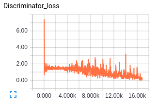
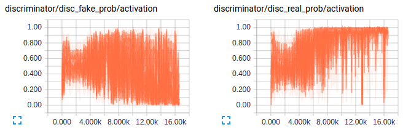

...Still under edit

##Difficulties training a Generative Adversarial Networks 
So GANs are like the happening thing in Deep learning right now (I mean even Yann Lecun said so right!). But this writeup is not about how awesome GANs are (which they are :punch:), 
this is going to be more on how freaking difficult it is to train these models. I believe GANs might be slightly ill posed as a problem for training with gradient descent. 
Took me quite some time to figure out why the hell my model was not working at all - hoping to throw some light for those folks who might fall in the same pit while trying to implement GANs. 

For a basic introduction to generative models and GANs refer to my notes [here](https://github.com/shekkizh/neuralnetworks.thought-experiments/blob/master/Generative%20Models/README.md). 

1. [Introduction](#introduction)
2. [Observations](#observations)
3. [Results](#results)
4. [References and Useful links](#references-and-useful-links)

##Introduction
**Setup**

The basic setup of GAN is two networks **G(z)** and **D(z)** trying to race against each other and reach an optimum more specifically a Nash equilibrium. The definition of Nash equilibrium as per wikipedia is
> (in economics and game theory) a stable state of a system involving the interaction of different participants, in which no participant can gain by a unilateral change of strategy if the strategies of the others remain unchanged.

If you think about it this is exactly what we are trying with GAN, the generator and discriminator reach a state where they cannot improve further given the other is kept unchanged. 

Now the setup of gradient descent is to take a step in a direction that reduces the loss measure defined on the problem - we are by no means enforcing the networks to reach Nash eq. in GAN  which have non convex objective in a high dimensional space with continuous parameters. The networks try to take successive steps to minimize a non convex cost and end up in a oscillating process rather than decreasing the underlying true objective. There is an excellent paper by Goodfellow that tries to explain this problem [On Distinguishability criteria for estimating Generative models](https://arxiv.org/pdf/1412.6515.pdf).

Setting aside the above issue in a wishful manner, let's just train GAN by gradient descent - But just be mindful of the issue and the fact your GAN model may not converge.

**Importance of intialization and model setup**

As mentioned above the setup is already unstable and so it's absolutely crucial to setup the networks in the best way possible. I tried to follow the DCGAN model setup by Radford et. al in their [paper](https://arxiv.org/pdf/1511.06434v2.pdf) but suffered from bad intialization. In most cases you can right away figure out something is wrong with your model when your discriminator attains a loss that is almost zero. The biggest headache is figuring out what is wrong :weary:

Another practical thing that is done while training GAN is to stall one network or purposefully make it learn slower so that the other network can catch up. Most of the times it's the generator that lags behind so we usually let the discriminator wait - This is fine to some extent but remember that for your generator to get better you need a good discriminator and vice versa. Ideally you would want both the networks to learn at a rate where both get better over time.

**Feature matching**

This is an idea proposed in [Improved techniques for training GANs](https://arxiv.org/pdf/1606.03498v1.pdf) paper. The idea is to use the features at the intermediate layers in the discriminator to match for real and fake images and make this a supervisory signal to train the generator. I found training only based on this feature matching metric ineffective by itself contrary to what is mentioned in the paper - the discriminator attains almost zero loss right at the beginning when I tried doing this. Instead a combination of both the feature matching loss and the discriminator output loss for generator was quite effective. I tried setting up this combination loss such that initially the discriminator output loss for generator dominates, this avoided the discriminator loss to reach zero in the early stages of the training.

##Observations

   

   

   

   

**Failed Training Observations** 

   

##Results
CelebA

Flowers

##References and Useful links
